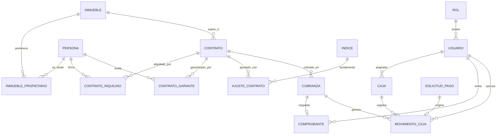

# Diseño de Base de Datos — SIGCOIN

## 1. Motor de Base de Datos y Criterios Técnicos

* **Motor RDBMS:** MySQL 8.0+.
* **Justificación de Elección Relacional:** Las operaciones contables inmobiliarias requieren relaciones estrictas (un contrato pertenece a un inmueble, una cobranza genera un comprobante inmutable y se registra en una caja). El cumplimiento de las propiedades **ACID** (Atomicidad, Consistencia, Aislamiento y Durabilidad) es obligatorio para resguardar la inmutabilidad financiera.
* **Convenciones de Diseño:**
  * Identificadores de Clave Primaria: `BIGINT UNSIGNED AUTO_INCREMENT`.
  * Importes Monetarios: `DECIMAL(15,2)` (nunca tipos de punto flotante IEEE).
  * Fechas de Transacción: `DATETIME` para marcas temporales de auditoría y `DATE` para períodos contables.
  * Trazabilidad y Bajas Lógicas: Uso de flags `activo BOOLEAN` y estados explícitos (`EMITIDO`, `ANULADO`, `PENDIENTE`, `VIGENTE`) para evitar borrado físico destructivo.

---

## 2. Entidades Principales del Sistema

| Tabla | Descripción / Propósito | Clave Primaria | Claves Foráneas Relevantes |
|---|---|---|---|
| `rol` | Perfiles de acceso al sistema (`ADMINISTRADOR`, `OPERADOR`). | `id` | - |
| `usuario` | Operadores del sistema con credenciales de acceso. | `id` | `rol_id` -> `rol(id)` |
| `persona` | Entidad única para propietarios, inquilinos y garantes. | `id` | - |
| `inmueble` | Propiedades/unidades administradas por la inmobiliaria. | `id` | - |
| `inmueble_propietario` | Tabla intermedia N:M con porcentaje de titularidad. | (`inmueble_id`, `persona_id`) | `inmueble_id`, `persona_id` |
| `contrato` | Contrato de locación comercial o residencial. | `id` | `inmueble_id` -> `inmueble(id)` |
| `contrato_inquilino` | Relación N:M de inquilinos firmantes del contrato. | (`contrato_id`, `persona_id`) | `contrato_id`, `persona_id` |
| `contrato_garante` | Relación N:M de garantes asociados al contrato. | (`contrato_id`, `persona_id`) | `contrato_id`, `persona_id` |
| `indice` | Histórico de valores de índices (ICL / IPC). | `id` | - |
| `ajuste_contrato` | Registro de ajustes de alquiler aplicados a un contrato. | `id` | `contrato_id`, `indice_id` |
| `cobranza` | Registro de pagos recibidos por canon locativo o concepto. | `id` | `contrato_id`, `registrado_por` |
| `comprobante` | Recibos inmutables y comprobantes complementarios. | `id` | `cobranza_id`, `emitido_por` |
| `caja` | Cajas chicas individuales por usuario y Caja Maestra. | `id` | `usuario_id` -> `usuario(id)` |
| `solicitud_pago` | Turnero de solicitudes de egreso pendiente. | `id` | `solicitante_id` -> `usuario(id)` |
| `movimiento_caja` | Auditoría de cada ingreso, egreso o transferencia. | `id` | `caja_id`, `cobranza_id`, `solicitud_pago_id`, `usuario_id` |

---

## 3. Diagrama Entidad-Relación (ERD Mermaid)

---

## 4. Índices y Reglas de Integridad Referencial

* **Restricciones Unique:**
  * Documentos e Identificadores fiscales: `persona(tipo_documento, numero_documento)` y `persona(cuit)`.
  * Nombre de usuario y Email: `usuario(nombre_usuario)` y `usuario(email)`.
  * Comprobantes: `comprobante(tipo, punto_venta, numero)` para garantizar la correlatividad estricta.
  * Índices por período: `indice(tipo, periodo)`.
  * Cobranza única por contrato y período: `cobranza(contrato_id, periodo)`.

* **Índices Secundarios de Rendimiento:**
  * Búsqueda por Apellido y Nombre: `idx_persona_apellido_nombre (apellido, nombre)`.
  * Búsqueda por Dirección de Inmueble: `idx_inmueble_direccion (direccion)`.
  * Filtro de Contratos vigentes/a vencer: `idx_contrato_estado_fin (estado, fecha_fin)`.
  * Movimientos de Caja por Fecha y Caja: `idx_movimiento_caja_fecha (caja_id, fecha_hora)`.

---

## 5. Scripts de Base de Datos

* Script DDL de Creación de Tablas: [`database/schema.sql`](../database/schema.sql)
* Script DML de Datos Iniciales y Prueba: [`database/seed.sql`](../database/seed.sql)
* [Diagrama UML de Clases del Dominio](diagrams/uml-class-diagram.md)
