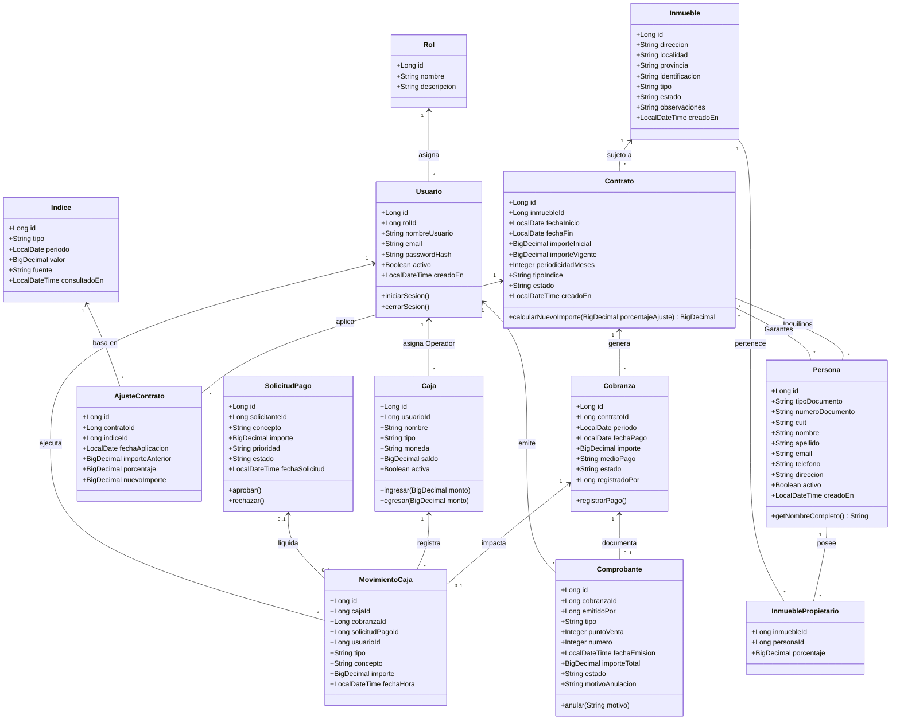

# Diagrama de Clases UML — Modelo de Dominio SIGCOIN

Este documento contiene la representación UML del modelo de dominio del **Sistema de Gestión Contable Inmobiliaria (SIGCOIN)**.

```mermaid
classDiagram
    class Rol {
        +Long id
        +String nombre
        +String descripcion
    }

    class Usuario {
        +Long id
        +Long rolId
        +String nombreUsuario
        +String email
        +String passwordHash
        +Boolean activo
        +LocalDateTime creadoEn
        +iniciarSesion()
        +cerrarSesion()
    }

    class Persona {
        +Long id
        +String tipoDocumento
        +String numeroDocumento
        +String cuit
        +String nombre
        +String apellido
        +String email
        +String telefono
        +String direccion
        +Boolean activo
        +LocalDateTime creadoEn
        +getNombreCompleto() String
    }

    class Inmueble {
        +Long id
        +String direccion
        +String localidad
        +String provincia
        +String identificacion
        +String tipo
        +String estado
        +String observaciones
        +LocalDateTime creadoEn
    }

    class InmueblePropietario {
        +Long inmuebleId
        +Long personaId
        +BigDecimal porcentaje
    }

    class Contrato {
        +Long id
        +Long inmuebleId
        +LocalDate fechaInicio
        +LocalDate fechaFin
        +BigDecimal importeInicial
        +BigDecimal importeVigente
        +Integer periodicidadMeses
        +String tipoIndice
        +String estado
        +LocalDateTime creadoEn
        +calcularNuevoImporte(BigDecimal porcentajeAjuste) BigDecimal
    }

    class Indice {
        +Long id
        +String tipo
        +LocalDate periodo
        +BigDecimal valor
        +String fuente
        +LocalDateTime consultadoEn
    }

    class AjusteContrato {
        +Long id
        +Long contratoId
        +Long indiceId
        +LocalDate fechaAplicacion
        +BigDecimal importeAnterior
        +BigDecimal porcentaje
        +BigDecimal nuevoImporte
    }

    class Cobranza {
        +Long id
        +Long contratoId
        +LocalDate periodo
        +LocalDate fechaPago
        +BigDecimal importe
        +String medioPago
        +String estado
        +Long registradoPor
        +registrarPago()
    }

    class Comprobante {
        +Long id
        +Long cobranzaId
        +Long emitidoPor
        +String tipo
        +Integer puntoVenta
        +Integer numero
        +LocalDateTime fechaEmision
        +BigDecimal importeTotal
        +String estado
        +String motivoAnulacion
        +anular(String motivo)
    }

    class Caja {
        +Long id
        +Long usuarioId
        +String nombre
        +String tipo
        +String moneda
        +BigDecimal saldo
        +Boolean activa
        +ingresar(BigDecimal monto)
        +egresar(BigDecimal monto)
    }

    class SolicitudPago {
        +Long id
        +Long solicitanteId
        +String concepto
        +BigDecimal importe
        +String prioridad
        +String estado
        +LocalDateTime fechaSolicitud
        +aprobar()
        +rechazar()
    }

    class MovimientoCaja {
        +Long id
        +Long cajaId
        +Long cobranzaId
        +Long solicitudPagoId
        +Long usuarioId
        +String tipo
        +String concepto
        +BigDecimal importe
        +LocalDateTime fechaHora
    }

    Rol "1" <-- "*" Usuario : asigna
    Usuario "1" <-- "*" Caja : asigna Operador
    Persona "1" -- "*" InmueblePropietario : posee
    Inmueble "1" -- "*" InmueblePropietario : pertenece
    Inmueble "1" <-- "*" Contrato : sujeto a
    Contrato "*" -- "*" Persona : Inquilinos
    Contrato "*" -- "*" Persona : Garantes
    Contrato "1" <-- "*" AjusteContrato : aplica
    Indice "1" <-- "*" AjusteContrato : basa en
    Contrato "1" <-- "*" Cobranza : genera
    Cobranza "1" <-- "0..1" Comprobante : documenta
    Cobranza "1" <-- "0..1" MovimientoCaja : impacta
    Caja "1" <-- "*" MovimientoCaja : registra
    SolicitudPago "0..1" <-- "0..1" MovimientoCaja : liquida
    Usuario "1" <-- "*" Comprobante : emite
    Usuario "1" <-- "*" MovimientoCaja : ejecuta
```
