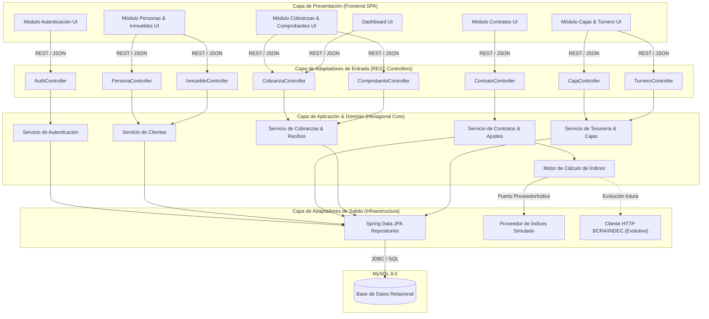

# Diagrama de Componentes UML y Estructura de Módulos

Este documento presenta el diagrama de componentes UML y la organización modular del **Sistema de Gestión Contable Inmobiliaria (SIGCOIN)**.

## Diagrama UML de Componentes del Sistema

