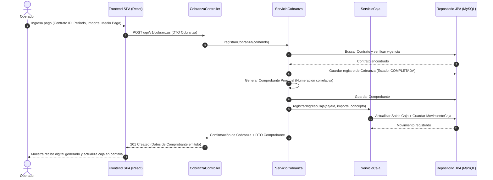
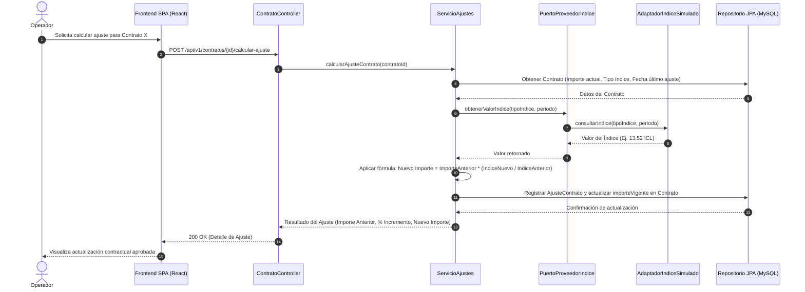
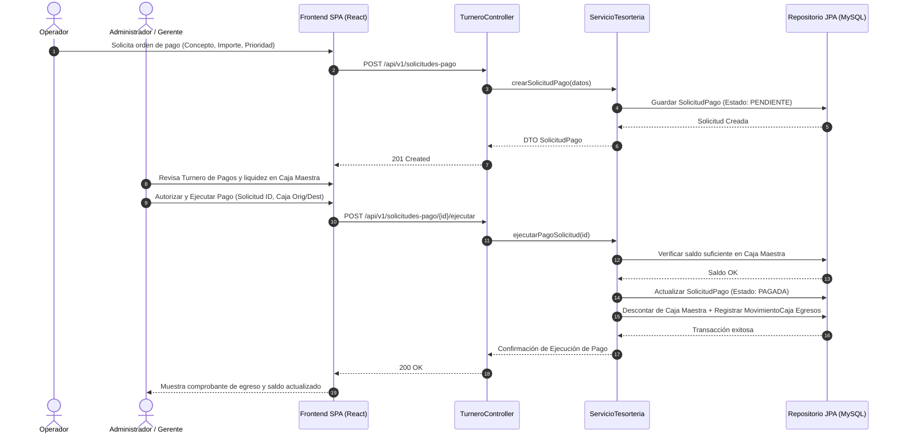

# Diagramas de Secuencia UML — Flujos Principales SIGCOIN

Este documento reúne los diagramas de secuencia UML correspondientes a los procesos de negocio críticos del **Sistema de Gestión Contable Inmobiliaria (SIGCOIN)**.

---

## 1. Flujo de Registro de Cobranza y Emisión de Comprobante

Este flujo describe cómo un operador registra el cobro del alquiler de un contrato y el sistema impacta el movimiento en la caja chica y emite el recibo inmutable.

---

## 2. Flujo de Cálculo e Incremento Automatizado de Alquileres (Ajuste por Índice)

Este flujo describe la consulta al proveedor de índices simulado (ICL/IPC) y el cálculo e incremento del canon locativo.

---

## 3. Flujo de Turnero de Pagos y Consolidación de Cajas

Este flujo documenta la solicitud de pago de un egreso (ej. liquidación a propietario o pago de servicio), su priorización en el turnero y la aprobación según liquidez de la Caja Maestra.

